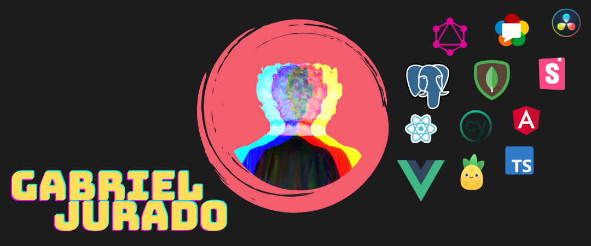

  

***

### Hello, hola  👋

<a href="https://www.linkedin.com/in/gsjuradogon/"> <svg xmlns="http://www.w3.org/2000/svg" width="24" height="24" viewBox="0 0 24 24" fill= "#0a66c2" margin="5"><path d="M19 0h-14c-2.761 0-5 2.239-5 5v14c0 2.761 2.239 5 5 5h14c2.762 0 5-2.239 5-5v-14c0-2.761-2.238-5-5-5zm-11 19h-3v-11h3v11zm-1.5-12.268c-.966 0-1.75-.79-1.75-1.764s.784-1.764 1.75-1.764 1.75.79 1.75 1.764-.783 1.764-1.75 1.764zm13.5 12.268h-3v-5.604c0-3.368-4-3.113-4 0v5.604h-3v-11h3v1.765c1.396-2.586 7-2.777 7 2.476v6.759z"/></svg> </a>

<a href="https://www.instagram.com/gsjuradog/"> <svg xmlns="http://www.w3.org/2000/svg" width="24" height="24" viewBox="0 0 24 24" fill= "#7431c6" margin="5"><path d="M15.233 5.488c-.843-.038-1.097-.046-3.233-.046s-2.389.008-3.232.046c-2.17.099-3.181 1.127-3.279 3.279-.039.844-.048 1.097-.048 3.233s.009 2.389.047 3.233c.099 2.148 1.106 3.18 3.279 3.279.843.038 1.097.047 3.233.047 2.137 0 2.39-.008 3.233-.046 2.17-.099 3.18-1.129 3.279-3.279.038-.844.046-1.097.046-3.233s-.008-2.389-.046-3.232c-.099-2.153-1.111-3.182-3.279-3.281zm-3.233 10.62c-2.269 0-4.108-1.839-4.108-4.108 0-2.269 1.84-4.108 4.108-4.108s4.108 1.839 4.108 4.108c0 2.269-1.839 4.108-4.108 4.108zm4.271-7.418c-.53 0-.96-.43-.96-.96s.43-.96.96-.96.96.43.96.96-.43.96-.96.96zm-1.604 3.31c0 1.473-1.194 2.667-2.667 2.667s-2.667-1.194-2.667-2.667c0-1.473 1.194-2.667 2.667-2.667s2.667 1.194 2.667 2.667zm4.333-12h-14c-2.761 0-5 2.239-5 5v14c0 2.761 2.239 5 5 5h14c2.762 0 5-2.239 5-5v-14c0-2.761-2.238-5-5-5zm.952 15.298c-.132 2.909-1.751 4.521-4.653 4.654-.854.039-1.126.048-3.299.048s-2.444-.009-3.298-.048c-2.908-.133-4.52-1.748-4.654-4.654-.039-.853-.048-1.125-.048-3.298 0-2.172.009-2.445.048-3.298.134-2.908 1.748-4.521 4.654-4.653.854-.04 1.125-.049 3.298-.049s2.445.009 3.299.048c2.908.133 4.523 1.751 4.653 4.653.039.854.048 1.127.048 3.299 0 2.173-.009 2.445-.048 3.298z"/></svg> </a> 

### 🔭 Currently working at Klimahelden GmbH --> company activity: https://github.com/GabrielJuradoG
and 🌱 learning all that is to know about programming, step by step of course. 

 **I know I will never be an expert but I will try to be one no mather what.💪**
 
*** 
Looking to collaborate on projects related to my three greatest passions: **gaming**, **cualitative research** and **sports**, if I can add some social impact to them it be the greatest combination.💥
 
💡 Am an anthropologist by profesion and a developer by passion  so ask me about anthropology, digitalization in cualitative research or anything Colombia related.

***

- 📫 How to reach me: gsuradogon@gmail.com

- 😄 Pronouns: He/Him/his, el

### My languages and tools
<code></code>
<code></code>
<code></code>
<code></code>
<code></code>
<code></code>
<code></code>
<code></code>
<code></code>
<code></code>

- ⚡ Fun fact: my patronus is a Tortoiseshell Cat 😼 I secretly love Cumbia in all its versions, from Totó la Momposina to Chico Trujillo! 💃 

